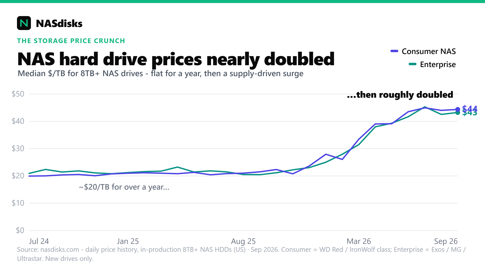
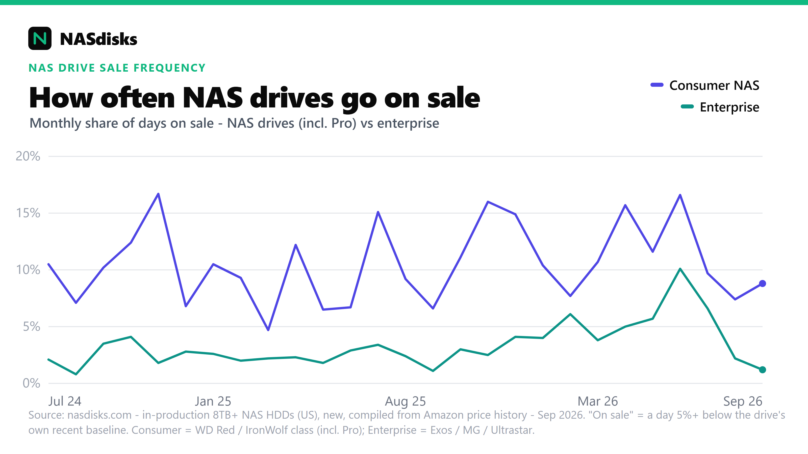

# NAS drive price trends

Two computed views of the NAS hard-drive market over time, both from our daily price history and maintained at [nasdisks.com](https://www.nasdisks.com/): what a terabyte costs, and how often drives actually go on sale. Scope throughout: in-production 8TB+ NAS hard drives, US, new in-stock prices, compiled from Amazon price history.

## Price per terabyte over time

Monthly median price-per-terabyte, split into the two tiers people choose between: consumer NAS (WD Red / IronWolf class) and enterprise (Exos / MG / Ultrastar).

Median price-per-TB sat flat around \$20/TB through 2024 and most of 2025, then roughly doubled to the mid-\$40s/TB from late 2025, and has held there since. Both tiers moved together: among new drives, enterprise is not the price-per-TB bargain it's assumed to be, and both got hit about equally. The usual driver is the AI datacenter buildout pulling high-capacity nearline supply. Because the tiers track each other, there's no reliable price-per-TB win from picking enterprise over consumer among new drives; the one genuine discount is the recertified/refurbished enterprise market, which isn't included here.

**Method.** For each month, take each drive's average price-per-TB across its logged days, then the median of those per-drive values across drives (so a model with more logged days doesn't skew the month). 8TB and up because small drives carry a much higher price-per-TB, and which small SKUs happen to be in stock would swing an all-capacity median for reasons unrelated to prices actually moving.

**File:**

- [`monthly-median-per-tb.csv`](monthly-median-per-tb.csv) - `month`, `consumer_usd_per_tb`, `enterprise_usd_per_tb`.

**Interactive version** (hover, zoom, and a capacity-matched cheapest-per-TB table): [nasdisks.com/articles/nas-drive-price-crunch](https://www.nasdisks.com/articles/nas-drive-price-crunch/).

## How often drives go on sale

How often each current drive actually dips *on sale*, and how deep.

NAS drives (WD Red / IronWolf class, including the Pro lines) go on sale several times more often than enterprise/datacenter drives - roughly one day in ten vs one in forty - though the cut is about the same size when it happens (~10% typical, ~30% at the deepest). Seagate IronWolf Pro goes on sale most often; Exos and Ultrastar barely move. It's a difference in frequency, not depth.

**Method.** For each day we compare a drive's best price to a centred rolling median of its own recent price, so a genuine dip counts but the long price climb is not mistaken for a discount, then count the days sitting 5%+ below that baseline. A "sale event" is a run of such days.

**Files:**

- [`sale-frequency-by-model.csv`](sale-frequency-by-model.csv) - per drive: `brand`, `line`, `capacity_tb`, `segment` (`consumer` = NAS lines incl. Pro, `enterprise` = datacenter), `pct_days_on_sale`, `typical_discount_pct`, `deepest_discount_pct`, `sale_events`, `days_observed`.
- [`sale-frequency-weekly.csv`](sale-frequency-weekly.csv) - weekly share of tracked days on sale per tier: `week_start`, `consumer_pct_days_on_sale`, `enterprise_pct_days_on_sale`.

**Interactive version** (weekly chart + sortable per-model table): [nasdisks.com/articles/nas-drive-sale-frequency](https://www.nasdisks.com/articles/nas-drive-sale-frequency/).

## Using this data

The figures here (monthly medians and sale-frequency aggregates) are free to use, with a credit to `nasdisks.com` (a link back is appreciated). They are computed aggregate statistics, provided as-is, and separate from the repository's CC BY 4.0 license, which covers the drive specs and CMR/SMR data.
